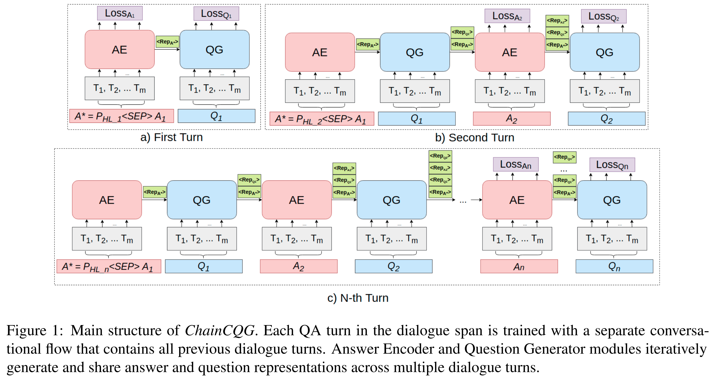

## Overview

ChainCQG is a two-stage architecture that learns question-answer representations across multiple dialogue turns using a flow propagation training strategy.




## Reproduction
1. First we need to download coqa dataset from [here](https://stanfordnlp.github.io/coqa/), then process it from Question Answer format into Question Generation format. It should be placed under `/data` folder.

2. We release both ChainCQG and other models in the paper. For ChainCQG, please use `run_generation_coqa_chaincqg.sh`. For other models such as `t5` or `bart`, please refer to `/OtherModel` folder. Changing hyperparameter inside the script should be enough if you want to try other settings such as different model.


if you find our work useful, please cite:
```
@inproceedings{bert-score,
  title={ChainCQG: Flow-Aware Conversational Question Generation},
  author={Jing Gu, Mostafa Mirshekari, Zhou Yu and Aaron Sisto},
  booktitle={European Chapter of the ACL },
  year={2021},
  url={place holder}
}
```
